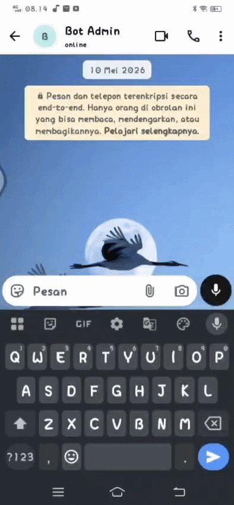

# Customer_Service_Chatbot

An AI-Powered Customer Service Automation System built on self-hosted infrastructure. This system automatically processes inbound customer inquiries, generates context-aware responses using LLMs, and handles data routing efficiently 24/7.

## 🎥 Video Demo
<!-- TIPS: Rekam workflow n8n & UI WhatsApp/Web pakai Loom atau jadikan GIF, lalu masukkan link/file-nya di bawah ini -->
[▶ Click here to watch the system in action (video in progress)]


---

## 📝 Project Overview

### ⚠️ The Problem
In traditional customer support, businesses often face bottlenecks due to:
* **Delayed Response Times:** Customers waiting hours for basic inquiries during peak times or outside business hours.
* **High Operational Costs:** Needing multiple human agents just to answer repetitive, frequently asked questions (FAQs).
* **Scattered Data:** Customer interactions and leads are not synchronized instantly into internal databases, leading to missed opportunities.

### 💡 The Solution
This project automates the entire first-line customer support pipeline. By deploying a self-hosted automation engine connected to advanced AI models, the system can:
* Provide **instant, context-aware responses** to customer queries within seconds, 24/7.
* Intelligently route complex issues or specific keywords to distinct business logic pathways.
* Automatically sync structured customer data and interaction logs into backend systems without human intervention.

---

## 🛠️ Technical Specifications

### Tech Stack
* **Automation Engine:** n8n (Self-Hosted via Docker Compose)
* **AI & LLM Integration:** Gemini API (Advanced AI / AI Agent nodes)
* **Gateway/API:** WAHA (WhatsApp HTTP API) / Custom Webhook Gateway
* **Database/Logs:** Vector Data Base Supabase

### System Architecture
Below is the data flow and logic routing implemented within the n8n canvas:

```mermaid
graph TD
    A[Inbound Customer Message] -->|Webhook Trigger| B(n8n Webhook Node)
    B --> C{Logic Router / Switch Node}
    C -->|Standard Query| D(AI Agent Node + Gemini API)
    C -->|Complex/Urgent Escalation| E(Internal Alert System / Human Handoff)
    D --> F(Data Formatter / Code Node)
    F --> G(Send Automated Response via API)
    F --> H(Log Interaction to Database/Sheets)
